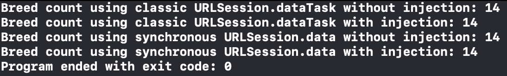

FancyCat
===========

 

## Introduction

FancyCat is a command-line tool that demonstrates dependency injection of `URLSession` and `URL` variants. I created FancyCat to accompany a [blog post](https://racecondition.software/blog/stubbing/) about this concept.

## Build Tools & Versions Used

I developed FancyCat using Xcode 14.1, macOS 12.5, and [this song](https://www.youtube.com/watch?v=CIpOxa5hxOw).

## Screenshot

## Credits

Paul Hudson [shared](https://www.hackingwithswift.com/articles/153/how-to-test-ios-networking-code-the-easy-way) the approach to dependency injection for `URLSession` used in `URLProtocolStub.swift` and `URLSessionExtension.swift`.

Christy Presler created FancyCat's repo's logo and released it under the [CC BY-SA 3.0 license](https://creativecommons.org/licenses/by-sa/3.0/).

